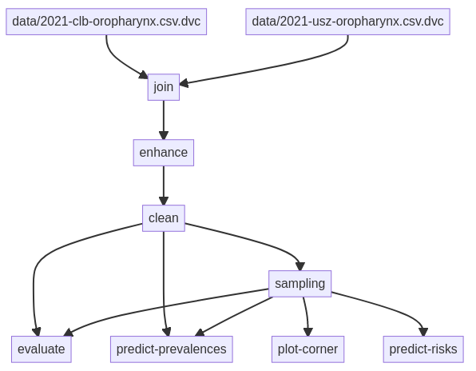

## What is **`lynference`**?

It is a repository that aims at making our research (modelling lymphatic cancer progression in head & neck cancer) completely reproducible. It essentially stores the pipelines we have created persistently. These pipelines include the data pre-processing, inference, evaluation and prediction.

The pipelines stored here largely depend on three other repositories:

1. The [`lymph`](https://github.com/rmnldwg/lymph) repository, where we develop the mathematical model in the form of a Python library. **If you want to learn more about how we model the lymphatic spread of head & neck cancer, you can find more info in this repository**
2. [`lyDATA`](https://github.com/rmnldwg/lydata), a repository that makes data on the patterns of lymphatic progression publicly available. This means we publish (anonymized) patient data here that details where in their lymphatic system the respective patient had lymph node metastases. The info over there is less mathematical and more clinical.
3. A command line tool [`lyscripts`](https://github.com/rmnldwg/lyscripts) tailored to the specific purposes and use cases within the pipelines published here.

## How to reproduce a pipeline

To define pipelines and make them persistent, we use a tool called [DVC]. Using this program, one can define a *pipeline file* (both the `dvc.yaml` at the root and the one inside the `pipeline` directory are such pipeline files) that details how DVC should execute various commands and how they depend on each other. After a successful run of a pipeline, DVC stores the MD5 hashes of all produced files in the `dvc.lock` file. This enables one to store the (large) data produced by different runs elsewhere while still having everything in version control.

The commands that DVC aims to chain together into a reproducible pipeline are largely commands from [`lyscripts`], which is a python package full of "convenience" methods and scripts that - in turn - use the code from our [`lymph-model`] library to perform e.g. data cleaning, inference, model comparison and predictions.

If you want to reproduce our work, then follow these steps:

1. Clone this repository using `git clone https://github.com/rmnldwg/lynference.git`
2. Enter the repo locally via `cd lynference`
3. Checkout the version of the repository that corresponds to the pipeline run you would like to reproduce, e.g. `git checkout <ref>`, where `<ref>` can be any git reference like a git tag or a commit hash
4. Create a virtual environment, e.g. using `python3 -m venv .venv`
5. Activate that virtual environment: `source .venv/bin/activate`
6. (Optional but recommended) Update the package manager with `pip install -U pip setuptools`
7. Install the requirements with `pip install -r frozen.txt`
8. And finally, run the pipeline with `dvc repro pipeline`

It could now take a while to run everything, but the programs that are being executed should keep you updated about its progress.

[DVC]: https://dvc.org
[`lyscripts`]: https://github.com/rmnldwg/lyscripts
[`lymph-model`]: https://github.com/rmnldwg/lymph

## Navigating the repo

Here's a little overview over this repository's contents and what they do:

### 📄 `dvc.yaml` and `pipeline/dvc.yaml`

The `dvc.yaml` _inside_ the `pipeline` folder defines the commands that should be run to reproduce the pipeline. It also defines what each command depends on (input files and parameters/settings) and what it outputs. In this way, it can connect the individual stages into a _directed acyclic graph_ (DAG), which is displayed at the top for the current pipeline.

The `dvc.yaml` at the root of the repository does some additional stuff like creating a visual representation of the mentiond DAG and - more importantly - export the current python environment into a `frozen.txt` file. However, running this requires additional dependencies and it is reallz onlz necessarz, when _creating_ a pipeline.

Look at the files and the desciptions we have put at each stage to get an idea of what happens there.

⚠️ **Warning:** Leave the `dvc.lock` file unchanged, it is managed by DVC.

### 📄 `params.yaml`

This is a configuration file that defines parameters and settings for the individual stages in the pipeline. Almost all the scripts in the `lyscripts` repository take a `--params` argument where this file is passed and use some keys and values defined there.

We have put extensive comments in that file that explain what each entry there does.

### 📄 `requirements.txt` and 📄 `frozen.txt`

These two text files define the Python packages necessary to run the pipeline. Note that **for reproduction**, you should **use `frozen.txt`**, as it is always created at the end of each pipeline run.

The `requirements.txt` file is only used by us during development.

### 📁 data

This folder contains the data the pipeline is fed with at the beginning. Inside, you can find some `.dvc` files as well. These define the raw data everything starts with and their MD5 hashes.

### 📁 models

During the run of the pipeline, a lot of samples and predictions are produced. Most of them are stored inside HDF5 files inside this models folder.

Essentially, all computationally intensive results are stored here from which plots and tables can be produced.

### 📁 plots

This stores both data series (e.g. as CSV files) and images of produced plots. Some of them serve as checks to ensure everything went smoothly during the computations.

### 📁 notebooks

Inside this folder are some Jupyter notebooks that we used earlier, until managing them got messy and it became difficult to keep track of what was used when. They might be removed from this repo at any point.

## Branching model

On our `main` branch we aim to always only publish tagged, working and reproducible pipelines and create releases from them, which may then also be stored on platforms like [zenodo].

So, if you want to see a list of pipelines we have published so far, head over to the [releases] on GitHub

The development of these pipelines happens in dedicated `pipeline-xyz` branches, which might reflect unfinished stages of a pipeline, where parts crash or where we still figure out some parameters.

[zenodo]: https://zenodo.org
[releases]: https://github.com/rmnldwg/lynference/releases

## Anything unclear?

If there are still unanswered questions regarding this work, don't hesitate to 📧 [contact us](mailto:roman.ludwig@usz.ch). We are happy to help and will provide you with what we can provide.
