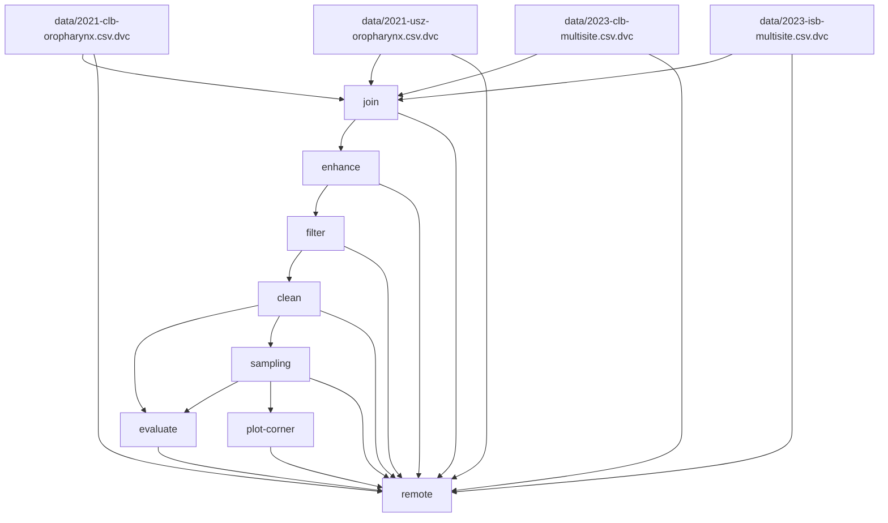

```mermaid
flowchart TD
	node1["data/2021-clb-oropharynx.csv.dvc"]
	node2["data/2021-usz-oropharynx.csv.dvc"]
	node3["data/2023-clb-multisite.csv.dvc"]
	node4["data/2023-isb-multisite.csv.dvc"]
	node5["clean"]
	node6["enhance"]
	node7["evaluate"]
	node8["filter"]
	node9["join"]
	node10["plot-corner"]
	node11["sampling"]
	node12["remote"]
	node1-->node9
	node1-->node12
	node2-->node9
	node2-->node12
	node3-->node9
	node3-->node12
	node4-->node9
	node4-->node12
	node5-->node7
	node5-->node11
	node5-->node12
	node6-->node8
	node6-->node12
	node7-->node12
	node8-->node5
	node8-->node12
	node9-->node6
	node9-->node12
	node10-->node12
	node11-->node7
	node11-->node10
	node11-->node12
```
