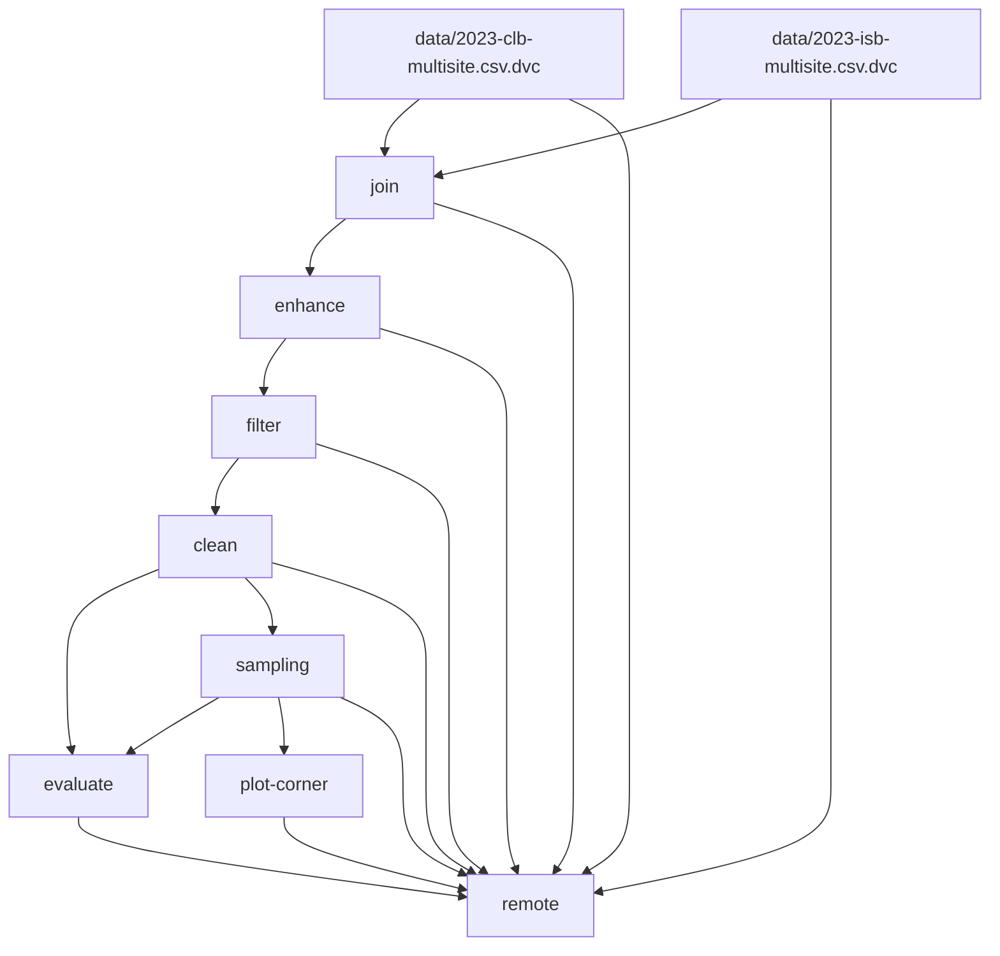

```mermaid
flowchart TD
	node1["data/2023-clb-multisite.csv.dvc"]
	node2["data/2023-isb-multisite.csv.dvc"]
	node3["clean"]
	node4["enhance"]
	node5["evaluate"]
	node6["filter"]
	node7["join"]
	node8["plot-corner"]
	node9["sampling"]
	node10["remote"]
	node1-->node7
	node1-->node10
	node2-->node7
	node2-->node10
	node3-->node5
	node3-->node9
	node3-->node10
	node4-->node6
	node4-->node10
	node5-->node10
	node6-->node3
	node6-->node10
	node7-->node4
	node7-->node10
	node8-->node10
	node9-->node5
	node9-->node8
	node9-->node10
```
