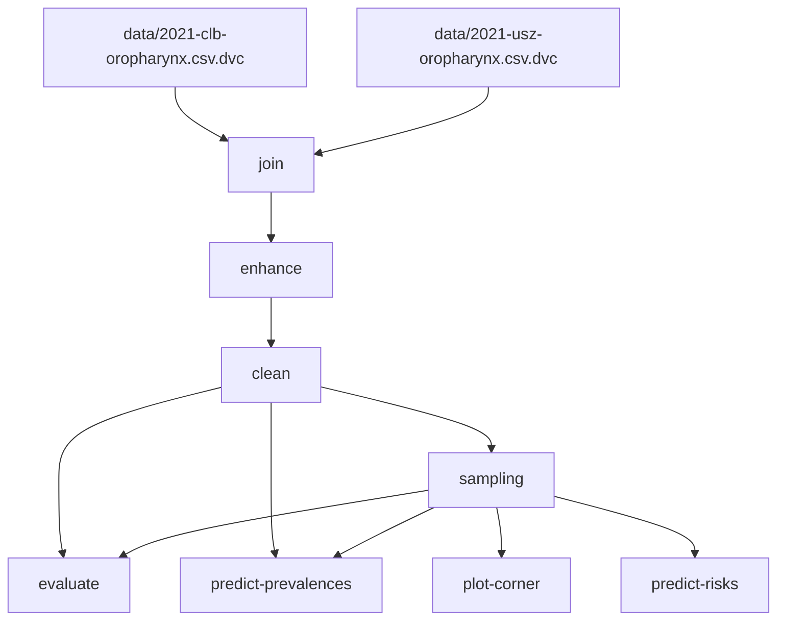

```mermaid
flowchart TD
	node1["data/2021-clb-oropharynx.csv.dvc"]
	node2["data/2021-usz-oropharynx.csv.dvc"]
	node3["clean"]
	node4["enhance"]
	node5["evaluate"]
	node6["join"]
	node7["plot-corner"]
	node8["predict-prevalences"]
	node9["predict-risks"]
	node10["sampling"]
	node1-->node6
	node2-->node6
	node3-->node5
	node3-->node8
	node3-->node10
	node4-->node3
	node6-->node4
	node10-->node5
	node10-->node7
	node10-->node8
	node10-->node9
```
