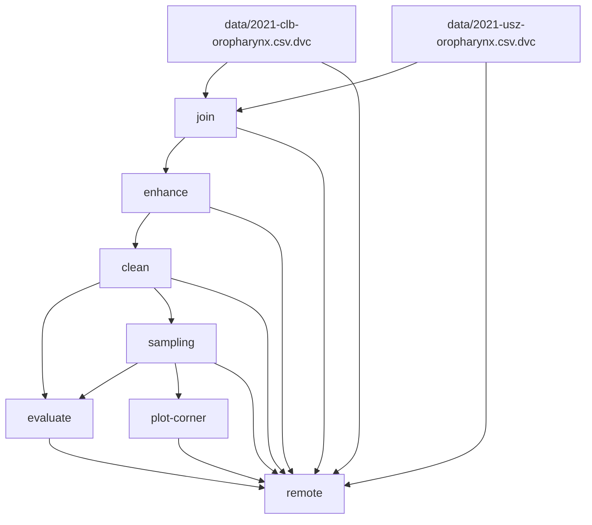

```mermaid
flowchart TD
	node1["data/2021-clb-oropharynx.csv.dvc"]
	node2["data/2021-usz-oropharynx.csv.dvc"]
	node3["clean"]
	node4["enhance"]
	node5["evaluate"]
	node6["join"]
	node7["plot-corner"]
	node8["sampling"]
	node9["remote"]
	node1-->node6
	node1-->node9
	node2-->node6
	node2-->node9
	node3-->node5
	node3-->node8
	node3-->node9
	node4-->node3
	node4-->node9
	node5-->node9
	node6-->node4
	node6-->node9
	node7-->node9
	node8-->node5
	node8-->node7
	node8-->node9
```
