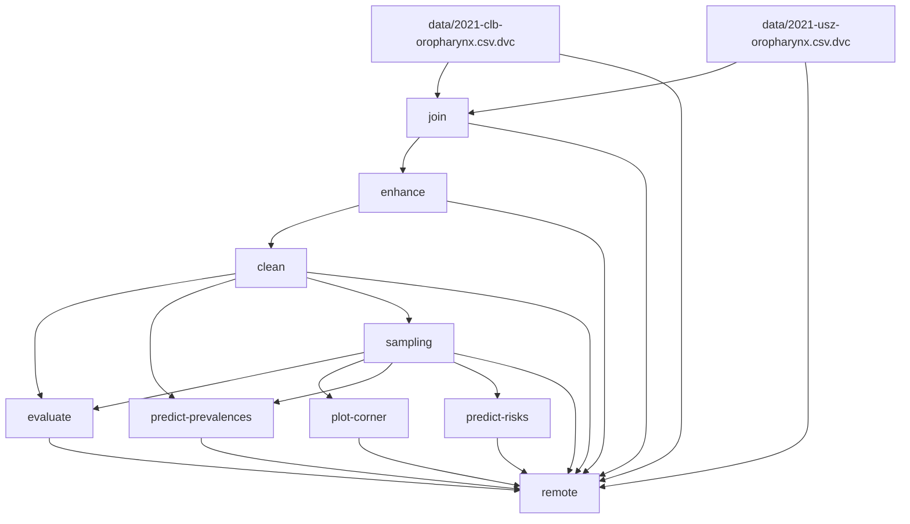

```mermaid
flowchart TD
	node1["data/2021-clb-oropharynx.csv.dvc"]
	node2["data/2021-usz-oropharynx.csv.dvc"]
	node3["clean"]
	node4["enhance"]
	node5["evaluate"]
	node6["join"]
	node7["plot-corner"]
	node8["predict-prevalences"]
	node9["predict-risks"]
	node10["sampling"]
	node11["remote"]
	node1-->node6
	node1-->node11
	node2-->node6
	node2-->node11
	node3-->node5
	node3-->node8
	node3-->node10
	node3-->node11
	node4-->node3
	node4-->node11
	node5-->node11
	node6-->node4
	node6-->node11
	node7-->node11
	node8-->node11
	node9-->node11
	node10-->node5
	node10-->node7
	node10-->node8
	node10-->node9
	node10-->node11
```
